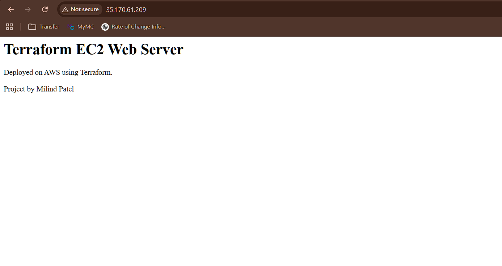
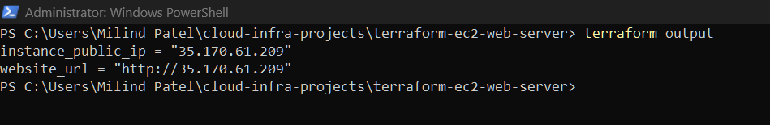
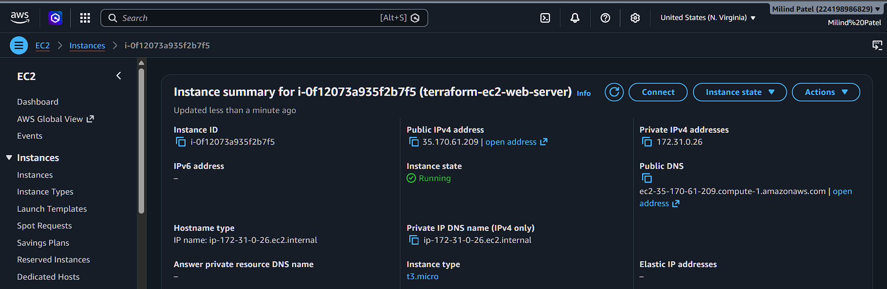
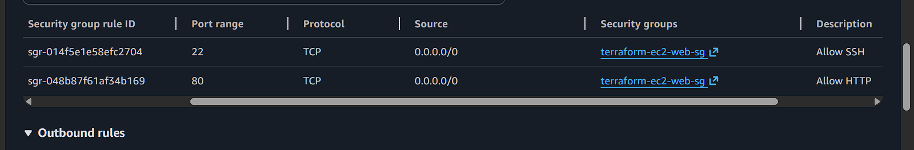

# AWS EC2 Web Server Deployment with Terraform

This project provisions an AWS EC2 web server using Terraform. It demonstrates Infrastructure as Code by creating an EC2 instance, configuring a security group, installing Apache through user data, and exposing a public web page through HTTP.


## Project Overview


The project creates:

- EC2 instance

- Security group

- HTTP access on port 80

- SSH access on port 22

- Apache web server installation using user data

- Terraform outputs for public IP and website URL


## Technologies Used


- Terraform

- AWS EC2

- AWS Security Groups

- AWS CLI

- PowerShell

- Apache HTTP Server

- HTML


## Architecture


User Browser → EC2 Public IP → Apache Web Server → index.html


## Terraform Commands Used


```bash

terraform init

terraform fmt

terraform validate

terraform plan

terraform apply

terraform output

```

## Live Website

```

http://35.170.61.209/

```

## Screenshots


### Live EC2 Website




### Terraform Output




### EC2 Instance Running




### Security Group Rules




## What I Learned


* How to provision an EC2 instance using Terraform
* How to configure AWS security groups with inbound and outbound rules
* How to allow HTTP traffic on port 80
* How to use user data to install and start Apache automatically
* How to output public IP and website URL values from Terraform
* Why cloud resources should be destroyed after documentation to avoid unnecessary cost


## Security Notes


This project allows SSH access from `0.0.0.0/0` for learning purposes only. In a production environment, SSH should be restricted to a trusted IP address.


Terraform state files are excluded from GitHub using `.gitignore.`


## Future Improvements


* Restrict SSH access to a specific trusted IP
* Add variables for instance type, region, and AMI ID
* Create a custom VPC and subnet instead of using the default VPC
* Add an Elastic IP
* Add CloudWatch monitoring
* Add remote backend state storage using S3


